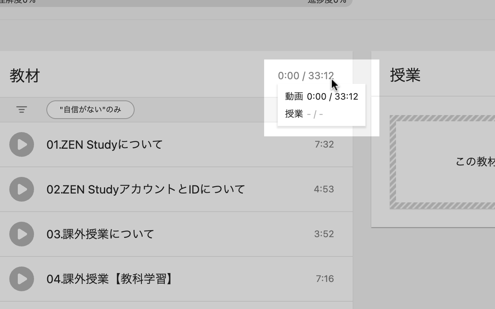
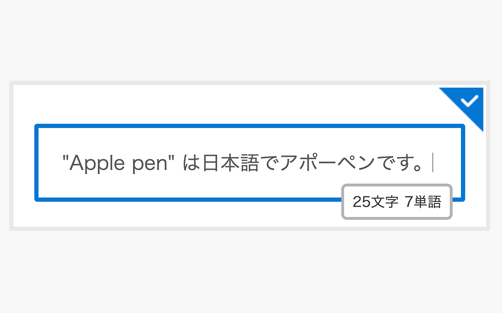

# ZEN Study +

ZEN Studyに様々な機能を追加するChrome拡張機能

## 機能

### 動画の合計時間の表示

- チャプターページに現在のチャプターの合計時間を表示
- コースページと月間レポートページに、含まれるそれぞれのチャプターの合計時間と全チャプターの合計時間を表示
- マイコースページに、含まれるそれぞれのコースの合計時間を表示 (デフォルトでは無効)

### テキスト入力時の単語数の表示

- 入力フィールドに文字数とともに単語数を表示
- 日本語のような単語間に空白がない言語でもカウント可能

### キーボードショートカット

- カスタマイズ可能なキーボードショートカットを利用できる
- 修飾キーを押していても反応してしまう問題がある、デフォルトの動画キーボードショートカットを無効にする

#### ショートカット一覧

- 動画コントロール (これらの多くは拡張機能無しでも使用可能だが、拡張機能無しではチャプターページのトップフレームからトリガー不能)
  - 再生/一時停止 (デフォルト: `K`)
  - 巻き戻し (デフォルト: `J`, 秒数は変更可能)
  - 早送り (デフォルト: `L`, 秒数は変更可能)
  - ミュート (デフォルト: `M`)
  - 全画面表示 (デフォルト: `F`)
  - ピクチャー・イン・ピクチャー (デフォルト: `P`)
- 前のセクション (デフォルト: `Ctrl+Shift+ArrowUp`)
- 次のセクション (デフォルト: `Ctrl+Shift+ArrowDown`)

### `Tab` キーによる操作の改善

- MathJaxの `Tab` キーによるフォーカスの無効化

## [N予備校+](https://github.com/Level222/n-yobiko-plus)との比較

- **学園のレポート以外の環境で動作**
- より多くの機能とオプション (予定)
- いくつかの機能が未実装
  - `Tab` キーによる完了ボタンのフォーカスなど、一部の機能はZEN Studyに組み込まれたので不要
  - ZEN Studyと直接関係がないため、成績確認表のハイライトは行はない

## ロードマップ

- [x] オプションページ
- [x] 動画の合計時間の表示
- [x] テキスト入力時の単語数の表示
- [x] キーボードショートカット
- [x] MathJaxの `Tab` キーによるフォーカスの無効化
- [ ] 入力履歴のバックアップ
