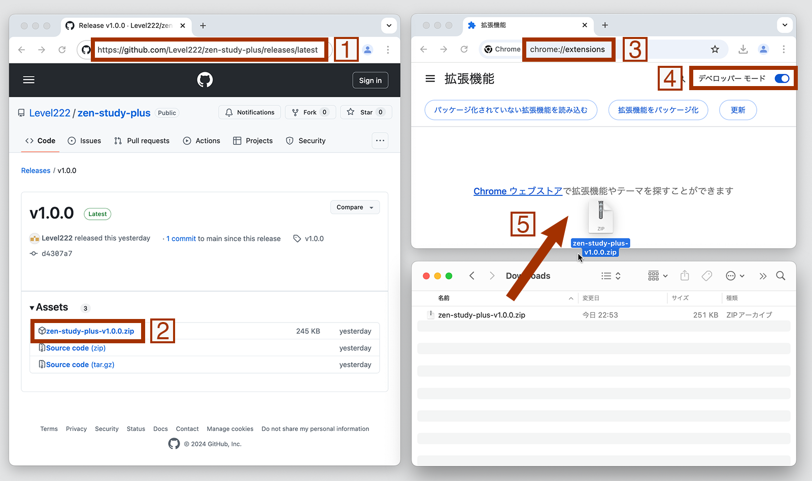

# ZEN Study +

ZEN Studyに様々な機能を追加するChrome拡張機能

## インストール

以下の2種類の方法から選択する。

### Chromeウェブストアからインストール

自動でアップデートされるため、一般的に推奨される。

下記ウェブストアにアクセスした際「Chrome Web Store へのアクセス権がありません。」と表示される場合、この方法でそのプロファイルに拡張機能をインストールすることができない。別のプロファイルに切り替えるか、後述の[Zipファイルをダウンロードしてインストールする方法](#zipファイルをダウンロードしてインストール)をとる必要がある。

1. [ZEN Study + の Chrome ウェブストア](https://chromewebstore.google.com/detail/bbnjgcjpnialjodpkneedbcflnidahac)にアクセス
2. 指示に従いインストール

### Zipファイルをダウンロードしてインストール

1. [最新のリリース](https://github.com/Level222/zen-study-plus/releases/latest)にアクセス
2. Assets内の `zen-study-plus-v{バージョン}.zip` をダウンロード (zipファイルは解凍不要)
3. アドレスバーから `chrome://extensions` にアクセス
4. 右上の `デベロッパーモード` を有効にする
5. ダウンロードしたzipファイルをドラッグアンドドロップ (インストールした後、zipファイルは不要なので削除可能)
6. 今後アップデートする際は、1~5の手順で再度インストールし、古い方の拡張機能は削除する

## 機能

### 動画の合計時間の表示

- チャプターページに現在のチャプターの合計時間を表示
- コースページと月間レポートページに、含まれるそれぞれのチャプターの合計時間と全チャプターの合計時間を表示
- マイコースページに、含まれるそれぞれのコースの合計時間を表示するボタンを設置

### テキスト入力時の単語数の表示

- 入力フィールドに文字数とともに単語数を表示
- 日本語のような単語間に空白がない言語でもカウント可能

### キーボードショートカット

- カスタマイズ可能なキーボードショートカットを利用できる
- 修飾キーを押していても反応してしまう問題がある、デフォルトの動画キーボードショートカットを無効にする

#### ショートカット一覧

- 動画コントロール (これらの多くは拡張機能無しでも使用可能だが、拡張機能無しではチャプターページのトップフレームからトリガー不能)
  - 再生/一時停止 (デフォルト: `K`)
  - 巻き戻し (デフォルト: `J`, 秒数は変更可能)
  - 早送り (デフォルト: `L`, 秒数は変更可能)
  - ミュート (デフォルト: `M`)
  - 全画面表示 (デフォルト: `F`)
  - ピクチャー・イン・ピクチャー (デフォルト: `P`)
  - シアターモード (デフォルト: `T`)
- セクションを拡大 (デフォルト: `Ctrl+B`)
- 前のセクション (デフォルト: `Ctrl+Shift+ArrowUp`)
- 次のセクション (デフォルト: `Ctrl+Shift+ArrowDown`)

### `Tab` キーによる操作の改善

- MathJaxの `Tab` キーによるフォーカスを無効化し、意図しないフォーカス移動が発生するのを防ぐ

### 補助テキストのサイズ調整

- 動画下部の補助テキストにスクロールバーが必ず表示されないようにする
- この機能を有効にしてもスクロールバーが表示された場合、余分な高さを追加可能

### 動画の固定表示の無効化

- 一度手動でウインドウをリサイズしない限り、固定表示するかどうかの再計算がされない問題のある動画の固定表示を無効化する

### オプションページ

- 拡張機能のポップアップ、または `chrome://extensions/` からアクセス可能な拡張機能詳細ページより利用する

## [N予備校+](https://github.com/Level222/n-yobiko-plus)との比較

- **学園のレポート以外の環境で動作**
- より多くの機能とオプション
- いくつかの機能が未実装
  - `Tab` キーによる完了ボタンのフォーカスなど、一部の機能はZEN Studyに組み込まれたので不要
  - ZEN Studyと直接関係がないため、成績確認表のハイライトは行はない

## 貢献方法

問題を報告・修正したり、機能を提案・追加したりする際は、[貢献方法](CONTRIBUTING.md)をご確認ください。

## ロードマップ

- [x] オプションページ
- [x] 動画の合計時間の表示
- [x] テキスト入力時の単語数の表示
- [x] キーボードショートカット
- [x] MathJaxの `Tab` キーによるフォーカスの無効化
- [x] 補助テキストのサイズ調整
- [x] 動画の固定表示の無効化
- [ ] 入力履歴のバックアップ

## ライセンス

[MIT](LICENSE)
